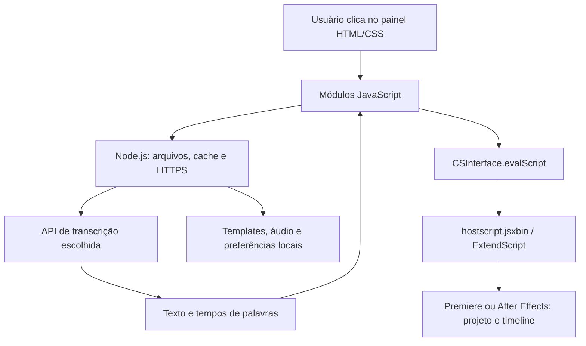

# Análise do Frame Speed instalado no Mac

Data: 17/09/2026. Versão declarada na instalação: **2.2**. Fabricante identificado: Victoframe.

Atualização posterior: a pedido do usuário, o JSXBIN foi descompilado em uma cópia local. Veja [a leitura do núcleo recuperado](descompilacao/LEITURA_DO_NUCLEO.md). As limitações abaixo descrevem o estágio anterior à recuperação.

O Frame Speed é uma extensão Adobe CEP: uma interface web dentro do Premiere Pro/After Effects, conectada a scripts que manipulam o projeto. Sua base combina **HTML/CSS/JavaScript, Node.js, ExtendScript, templates e APIs de transcrição**. A automação de edição é organizada em módulos, com boa parte das decisões calculada no próprio painel.

Esta análise foi feita por leitura dos arquivos instalados e consulta à documentação oficial. Não executei o plugin, não alterei projetos, não enviei mídia para APIs e não testei a qualidade de cortes ou legendas. “Confirmado no código” indica implementação observada, não comprovação de sucesso em execução.

## 1. Onde está instalado e o que contém

Pasta principal:

`/Library/Application Support/Adobe/CEP/extensions/com.victoframe.framespeed`

Instalador localizado:

`/Users/ppvfx/Documents/Frame Speed/FrameSpeed 2.2 - MAC PKG/FrameSpeed_2.2_MAC.pkg`

Inventário: **513 arquivos, 201.584.294 bytes — aproximadamente 192,25 MiB**. Há 28 arquivos JavaScript, dois CSS e uma página HTML. Não encontrei pesos de modelos de IA nem executável FFmpeg dentro dessa pasta.

| Componente | Papel observado |
|---|---|
| `CSXS/manifest.xml` | Registro da extensão, programas hospedeiros e carregamento do painel |
| `index.html` | Interface, controles e carregamento dos módulos |
| `css/style.css`, `css/auth.css` | Aparência do painel e do login |
| `js/main.js` | Biblioteca de templates, preferências, aplicação de estilos e coordenação principal |
| `js/CSInterface.js` | Ponte Adobe entre o painel e o programa de edição |
| `jsx/hostscript.jsxbin` | Código ExtendScript codificado que executa operações dentro da Adobe |
| `templates/` | Modelos de texto, prévias e efeitos sonoros |
| `presets/` | Exportação de áudio, legenda básica, camada de ajuste e curvas de zoom |
| `TRILHAS VIRAIS/` | Biblioteca local de músicas |
| `guias/` | Imagens de grades e áreas de referência para enquadramento |

O manifesto habilita Node.js e contexto misto. Declara Premiere (`PPRO`) no intervalo `[13.0,99.9]`, After Effects (`AEFT`) em `[16.0,99.9]` e runtime CSXS 9.0. Esses intervalos são declarações de compatibilidade; não certificam todos os recursos em todas as versões.

## 2. Como as peças se comunicam

O painel prepara dados e comandos; `CSInterface.evalScript` chama funções no ambiente da Adobe. Respostas frequentemente retornam como JSON. Essa separação corresponde à arquitetura descrita pela [documentação oficial Adobe CEP](https://github.com/Adobe-CEP/Getting-Started-guides).

Chamadas observadas incluem `injectMogrtPremiere`, `fsExportAudioTrilha`, `fsAutocutApply`, `fsApplyTransitions`, `fsZoomCamada` e `fsAutoTrilhaAplicar`. Os nomes e parâmetros mostram a intenção das operações; a implementação interna dessas funções não está toda disponível como fonte legível.

## 3. Transcrição: onde entra a IA

Em `js/transcription.js`, há três configurações:

| Serviço | Modelo configurado no plugin | Destino |
|---|---|---|
| Groq | `whisper-large-v3` | `api.groq.com/openai/v1/audio/transcriptions` |
| OpenAI | `whisper-1` | `api.openai.com/v1/audio/transcriptions` |
| Personalizado | Configurável | Host e caminho informados no painel |

Esses são os valores do código instalado. Não consultei contas, disponibilidade, preços ou limites atuais dos provedores.

O fluxo observado é: obter/exportar áudio → ler os bytes → enviar uma requisição HTTPS multipart → receber JSON com texto e marcações de tempo → organizar blocos de legenda. A requisição solicita `verbose_json` e tempos por segmento e por palavra. Há rotinas para exportação em trechos e para remapear tempos depois dos cortes.

No Premiere, o painel solicita exportação de áudio usando presets `.epr`. Existe também seleção de arquivo para transcrever. Nesse caminho, o arquivo selecionado é lido e enviado; não se deve pressupor que todo vídeo escolhido manualmente seja convertido localmente para apenas áudio antes do envio.

**Não há evidência de um modelo de transcrição próprio rodando dentro dessa instalação.** O recurso depende de um serviço de transcrição e de uma chave configurada. A presença de um endereço personalizado não comprova suporte imediato a qualquer servidor local: o cliente observado usa HTTPS e exige uma resposta compatível.

## 4. AutoCut: como detecta silêncio

O módulo `js/autocut.js` contém processamento local de áudio:

1. Solicita exportação de áudio da timeline.
2. Decodifica o arquivo com Web Audio (`AudioContext` / `decodeAudioData`).
3. Combina os canais e mede a energia RMS em janelas de aproximadamente **10 ms**.
4. Converte a medida para decibéis.
5. Estima fundo e fala por percentis: aproximadamente 10% e 95%.
6. Calcula um limiar conforme a sensibilidade. Há recusa da estimativa quando o contraste é menor que 8 dB.
7. Usa duração mínima, margens e limiares diferentes para entrar/sair do silêncio, evitando alternância excessiva na detecção.
8. Produz uma lista de intervalos e pede ao código da Adobe que realize os cortes.

Também há proteções relacionadas à transcrição, prévia, opção de backup, acompanhamento e parada. O comportamento exato da remoção e recomposição dos clipes depende do `.jsxbin`.

A consequência prática é que ruído, música misturada à fala e pouco contraste de volume podem dificultar a detecção. O AutoCut observado é principalmente um algoritmo de análise de sinal e regras de corte.

## 5. Retake: como encontra repetições

`js/repeticoes.js` usa palavras com início e fim obtidas da transcrição. O processamento observado:

- Normaliza texto, removendo diferenças de caixa, acentos e pontuação.
- Separa frases por pontuação e pausas.
- Compara sequências de palavras com programação dinâmica, no padrão de maior subsequência comum, tolerando pequenas diferenças de grafia.
- Usa proporções de semelhança e cobertura para classificar repetições e recomeços.
- Tem regras para tentativas curtas, frases incompletas e desempate apoiado por métricas de áudio.
- Devolve grupos e intervalos candidatos a remoção.

O AutoCut ainda pode ajustar as bordas desses intervalos usando a onda sonora. Há verificações contra transcrição desatualizada.

Isso explica uma limitação: duas frases parecidas podem ter diferenças relevantes de sentido. A comparação textual e sonora observada não equivale a uma avaliação editorial completa do conteúdo.

## 6. Legendas, templates e aparência

Encontrei **79 pares de templates**, cada par com uma versão `.fsm` e uma `.fsa`, além de prévias JPG e MP4. São 79 modelos nessas duas versões, não 158 estilos distintos.

O código principal distingue os formatos por programa: `.fsm` é preparado como `.mogrt` para Premiere; `.fsa`, como `.aep` para After Effects. Os arquivos empacotados são preparados em cache antes da aplicação. Não extraí esses assets.

O plugin cruza texto e tempo da transcrição/SRT com o modelo escolhido e configura propriedades como fontes, cores e posicionamento. `autodistribute.js` organiza blocos e escolhe modelos considerando linhas, duração, pausas e duração da animação. `captions.js` trata operações de legendas; `styleclone.js` copia propriedades; `clientes.js` guarda e exporta estilos por cliente.

O trabalho visual depende bastante dos templates previamente preparados e dos controles expostos por eles. O código disponível não indica geração de uma animação inédita por IA a cada aplicação.

## 7. AutoEdit e acabamento

O array de etapas em `js/autoedit.js` contém **oito etapas**, nesta ordem:

**Transcrição → Retake → Corte de silêncios → Legendas → Zoom → Transição → SFX → Trilha de fundo.**

Cada etapa chama um módulo e aguarda seu retorno. O usuário pode ligar/desligar etapas e solicitar parada depois da etapa atual. Há tratamento de erro e relatórios de diagnóstico.

A [página pública do fabricante](https://speed.victoframe.com/) apresenta AutoEdit, AutoCut, Retake, legendas e acabamento, mas mostra uma demonstração com nove etapas. Para descrever esta instalação, prevalece o array local de oito etapas; a diferença não comprova defeito.

Outros módulos observados:

| Módulo | Função |
|---|---|
| `dinamica.js` | Zoom, transições, camadas de ajuste e tela dividida |
| `jlcut.js` | Controles de J/L cut |
| `autosfx.js` / `sfxopcoes.js` | Distribuição e ajustes de sons da biblioteca |
| `autotrilha.js` | Seleção/inserção de músicas, volume e pedidos de crossfade |
| `fxpresets.js` / `prfpset.js` | Operações relacionadas a efeitos e presets |
| `animtexto.js` | Comandos de animação de texto |
| `guias.js` | Aplicação e remoção de guias |

A instalação contém **49 músicas M4A** e **86 arquivos WAV/MP3** distribuídos nas pastas de templates/sons. A sonorização observada reutiliza arquivos existentes; não encontrei chamada de geração de música ou SFX por IA nesses módulos.

## 8. Arquivos locais e dependências externas

| Local / destino | Uso observado |
|---|---|
| `~/Documents/Frame Speed/_config/preferencias.json` | Espelho de parte das preferências |
| `~/Documents/Frame Speed/_cache/` | Templates preparados para aplicação |
| `~/Documents/Frame Speed/.cache/` | Cache de legendas associado a projeto/sequência |
| `~/Documents/Frame Speed/Estilos exportados/` | Destino previsto para exportar estilos de clientes |
| `~/Library/Application Support/Victoframe/FrameSpeed/session.json` | Persistência de sessão de autenticação |
| `localStorage` do painel | Preferências, estado e chave de transcrição |
| `framespeed.victoframe.com/api` | Login, validação, logout e consulta de versão |
| Provedor de transcrição escolhido | Recebe o arquivo enviado para transcrever |

A existência das pastas `_cache`, `.cache`, `_config` e do arquivo de sessão foi verificada. Os demais destinos acima foram identificados no código; sua presença em disco não foi presumida. O módulo de preferências exclui explicitamente a chave de transcrição de seu espelho JSON. Não li os valores de credenciais ou o conteúdo do arquivo de sessão.

## 9. Até onde temos a base dele

**Disponível para análise:** estrutura do painel, módulos JavaScript distribuídos, HTML/CSS, manifesto, nomes e parâmetros de comandos, formatos de dados e organização dos assets. O JavaScript está majoritariamente minificado/ofuscado, mas vários fluxos são identificáveis.

**Não disponível como fonte legível:** o núcleo `jsx/hostscript.jsxbin` de 616.536 bytes. Seu cabeçalho confirma JSXBIN. O manifesto informa que o `.jsx` original não é distribuído. Não foi feita descompilação.

**Fora desta instalação:** código do servidor de licença e dos provedores de transcrição. Também não verifiquei correspondência criptográfica entre os arquivos instalados e o instalador encontrado; a análise descreve o estado local, sem atestar sua origem ou integridade oficial.

Portanto, temos um mapa consistente da arquitetura e de boa parte das regras, mas não o projeto-fonte completo nem uma reprodução integral do motor.

## 10. Base para uma implementação própria

Se a intenção for desenvolver uma ferramenta própria com funções semelhantes, a decomposição técnica mais útil é:

1. Painel com configurações e prévia.
2. Adaptador para ler a timeline e executar comandos no editor.
3. Transcrição que devolva palavras e tempos, podendo ser local em um projeto novo.
4. Motor separado de análise de silêncio e repetições.
5. Plano de edição contendo intervalos, legendas e aplicação de efeitos.
6. Remapeamento dos tempos após cortes, respeitando os frames da sequência.
7. Biblioteca própria de templates e sons.
8. Aplicação com backup, progresso e revisão do resultado.

Pela análise, as partes de maior esforço são a execução confiável na timeline, o vínculo entre áudio e vídeo, o alinhamento temporal depois dos cortes e a parametrização de templates. A interface é apenas uma parte da solução.

Essa é uma proposta de arquitetura, não uma implementação entregue. O inventário anexo registra os arquivos examinados e hashes SHA-256 dos componentes de código/configuração para futuras comparações.

## Referências

- Evidência principal: arquivos da instalação local e inventário anexo.
- [Adobe — guias oficiais de extensões CEP](https://github.com/Adobe-CEP/Getting-Started-guides).
- [Adobe — CEP 9 HTML Extension Cookbook](https://github.com/Adobe-CEP/CEP-Resources/blob/master/CEP_9.x/Documentation/CEP%209.0%20HTML%20Extension%20Cookbook.md).
- [Victoframe — página pública do FrameSpeed](https://speed.victoframe.com/).
