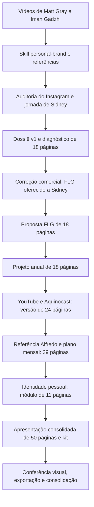

# Como a análise de Sidney Monteiro foi construída

Leitura e reconstrução em 08/09/2026. Fonte preservada: `/Volumes/SSD_PP_FRZ/FILIPE/SIDNEY ANALISE`. As pesquisas públicas do projeto estão datadas de **07/09/2026**. Os números mencionados nos documentos representam aquela coleta; esta leitura não atualizou os perfis na internet.

O trabalho reuniu pesquisa, construção de método, diagnóstico, definição de proposta comercial, planejamento editorial, design e geração técnica. A skill `personal-brand` organiza o raciocínio. Os dossiês preservam evidências e decisões. Scripts específicos transformam a redação editorial em apresentações, PDFs e imagens.

## 1. Alcance desta leitura

Foi percorrida a árvore completa da pasta, incluindo arquivos ocultos. Foram lidos os documentos de trabalho, instruções do método, as 12 transcrições preservadas, os 16 scripts `.mjs`, conteúdos das sete apresentações HTML e textos dos sete PDFs. As versões anteriores foram comparadas com a final para recuperar decisões que saíram ou foram substituídas. As 50 páginas do PDF final foram renderizadas localmente e inspecionadas em painéis; uma página foi também ampliada para conferir legibilidade e margens.

Os arquivos de perfil do Chrome, extensões, bancos e caches foram classificados e conferidos por inventário e integridade. Não se realizou uma análise semântica de cada arquivo interno dessas extensões: eles não são fontes editoriais do estudo. Ler as transcrições não equivale a assistir integralmente aos vídeos, e esta revisão não recupera stories ou dados privados que nunca foram coletados.

### Conferência do acervo

| Verificação | Resultado |
|---|---|
| Arquivos atuais, excluindo `._*` e `.DS_Store` | 10.088, totalizando 295.409.129 bytes |
| Manifesto original | 10.087 entradas |
| Arquivos com hash correspondente ao manifesto | 10.084; nenhum conteúdo divergente entre os presentes |
| Ausências | 3 arquivos `searchterms.json` de extensões do Chrome dentro de perfis de QA |
| Arquivos adicionais ao manifesto | O próprio inventário, `COMECE-AQUI.md`, o script de consolidação e o leia-me das transcrições |
| PDFs | 7 documentos; 178 páginas somadas, incluindo versões repetidas |
| Kit ZIP | CRC sem erro; 39 de 39 arquivos idênticos aos da pasta `identidade-sidney` |

As ausências identificadas não atingem os documentos, transcrições ou entregáveis finais. Os nomes internos do ZIP usam separadores Windows; a comparação normalizou esses separadores sem modificar o arquivo.

## 2. A sequência documentada

Essa ordem é sustentada pelos dossiês e pelas dependências dos scripts. A pasta não contém o histórico integral da conversa nem todos os comandos e prompts executados. Portanto, permite reconstruir o processo editorial e técnico, mas não transcrever literalmente toda a sessão original.

## 3. Primeiro, construir o método

O método foi elaborado a partir dos vídeos de Matt Gray (`lRe3iKyAXQA`) e Iman Gadzhi (`5pAQcC9YniM`). O pacote contém `SKILL.md`, configuração do agente e três referências: fontes, método e modelo de dossiê.

De Matt Gray foram aproveitados o diagnóstico de maturidade da marca, a organização de assuntos e a produção com reaproveitamento. A estrutura **4–3–2–1** delimita quatro temas, três formas de expressão, dois formatos e um canal principal. Os estágios descritos pelo autor ajudam a discutir dependência do fundador e capacidade de operação.

De Iman foram aproveitados intenção, escolha de plataforma, adequação do público, conteúdo com utilidade, estrutura de ideias e prática antes da publicação. Autenticidade, impacto e intenção funcionam como critérios de qualidade. A organização por nicho, problema e solução ajuda a desenvolver pautas.

O método local filtra as referências: cifras, promessas de riqueza, volumes extremos e a ideia de vender conhecimento apenas sintetizado por IA não viram recomendações automáticas. O resultado é um processo em 12 etapas:

1. Definir objetivo, ponto de partida e distância até o resultado desejado.
2. Levantar identidade, repertório, provas e limites de exposição.
3. Identificar público e problemas relevantes.
4. Formular um posicionamento que possa ser demonstrado.
5. Organizar narrativa e voz com amostras reais.
6. Escolher canal, formatos e capacidade de produção.
7. Estruturar temas e formas de expressão.
8. Produzir um piloto viável e revisar sua qualidade.
9. Desenhar relacionamento e próximo passo.
10. Conectar uma oferta quando fizer sentido para o objetivo.
11. Definir produção, reaproveitamento e responsabilidades.
12. Medir, aprender e registrar o próximo ciclo no dossiê.

O piloto de até cinco conteúdos em dez dias é uma referência de prática condicionada à capacidade, não uma obrigação universal de publicação.

## 4. Aplicar o método às evidências de Sidney

O dossiê v1 começa pelo Instagram e pelo percurso do visitante. A coleta registra bio, vínculos institucionais, destaques visíveis, fixados, 24 entradas da grade, dois carrosséis completos e conteúdos selecionados. A página de links tinha seis caminhos; foram examinados destinos como livro e Maestria, incluindo a abertura de um formulário sem enviá-lo.

Os 34.386 seguidores, 242 publicações e 1.486 perfis seguidos eram contadores observados. O estudo não tinha Insights, retenção, dados de atendimento ou vendas. Curtidas de posts selecionados também não autorizavam concluir uma taxa representativa de engajamento.

A interpretação central foi que Sidney já tinha experiência, presença institucional e temas de gestão, mas poderia explicitar melhor sua contribuição ao empresário. Daí surgiram três frentes: clareza na apresentação, demonstração do raciocínio e orientação do próximo passo.

O posicionamento proposto relacionava gestão e liderança à compreensão dos resultados e a uma empresa menos dependente das decisões diárias do dono. Isso foi registrado como hipótese que precisaria de casos reais. A análise organizou quatro territórios: **Lucro Oculto, liderança, cultura na execução e visão empresarial**. Lucro Oculto já aparecia na comunicação; o estudo não comprovou exclusividade da expressão.

Os dois carrosséis completos ajudaram a separar afirmações gerais de demonstrações. O material da China, por exemplo, permitia sugerir uma continuação com observação, interpretação e aprendizado após a experiência efetiva. O próximo passo dependia do negócio que Sidney desejasse priorizar.

Fontes principais: `2026-09-07-dossie-v1.md` e `2026-09-07-evidencias.md`.

## 5. Corrigir a proposta comercial e ampliar o horizonte

O dossiê v2 registra uma correção decisiva: **FLG é o serviço oferecido a Sidney**. Sidney seria o cliente do projeto. A comunicação dele apoiaria seus negócios e programas, com a prioridade comercial ainda por escolher.

O diagnóstico foi reescrito como proposta de trabalho: estratégia, repertório e conteúdo, apresentação e jornada, acompanhamento. A primeira proposta sugeria 90 dias e deixava escopo, produção, frequência e investimento para dimensionamento.

O dossiê v3 documenta a mudança para **12 meses**, distribuídos em quatro fases. A proposta ganhou direção visual laranja e preta, referência G4 Valley indicada no briefing, tipografia Manrope, retrato institucional e imagem abstrata de metal laranja. O prompt dessa imagem está preservado; há referência ao uso de `image_gen`.

A duração anual substitui o horizonte inicial de 90 dias. Os primeiros 90 dias continuam úteis como ciclo de fundação e revisão. Valores comerciais, composição final da equipe e quantidades contratadas não foram fechados pelos materiais.

Fontes: `briefing-flg.md`, `2026-09-07-dossie-v2-flg.md` e `2026-09-07-dossie-v3-anual.md`.

## 6. Acrescentar YouTube, Shorts e Aquinocast

O estudo seguinte inventariou 37 vídeos e sete Shorts do canal pessoal, além de oito episódios do Aquinocast. A análise original leu quatro transcrições integralmente e trechos selecionados de dois episódios longos. O script `.youtube-excerpts.mjs` preserva as janelas escolhidas para Vinicius e Davi.

Isso permitiu dar funções aos canais: proximidade no Instagram, explicação no canal pessoal, descoberta por recortes autônomos e profundidade no Aquinocast. Também foram identificados ajustes de apresentação e continuidade, como título pouco informativo, links e chamadas incompatíveis com os recursos observados.

Uma precaução editorial aparece repetidamente: uma fala do convidado não pode ser apresentada como experiência ou declaração de Sidney. Um corte deve entregar uma ideia compreensível fora do episódio.

Na leitura atual, foram lidas por inteiro as transcrições preservadas dos episódios com Vinicius e Davi. Isso amplia meu entendimento do acervo, mas não muda retroativamente o alcance da análise original. As falas sobre cadência, dinheiro, identidade, família e negócios continuam sendo declarações dos participantes; não constituem, por si, fatos auditados ou regras de plataforma.

Fonte: `2026-09-07-analise-youtube-aquinocast.md`.

## 7. Estudar Alfredo e converter referências em operação mensal

A referência Alfredo Soares amplia a pesquisa para formatos estáticos, vídeos de raciocínio aplicado, bastidores e continuidade comercial. O estudo original registra 48 entradas de Instagram, metadados de 30 vídeos longos, 45 Shorts recentes e 45 em alta, além de 16 TikToks recentes e 24 populares. Essas listas podem se sobrepor; não representam uma soma de publicações únicas integralmente assistidas.

Foram lidas originalmente duas transcrições longas completas, a abertura de um terceiro vídeo e um Short integral. A leitura atual também cobriu a transcrição completa desse terceiro vídeo, `RgOnl2YdfWk`.

As aplicações úteis foram concretas: uma foto de encontro ganha contexto e aprendizado; um card apresenta uma tese que a legenda desenvolve; um carrossel mostra uma decisão; uma visita pode originar uma análise posterior. A função de cada formato determina sua adaptação. A presença e a reputação de Alfredo não são transferidas para Sidney.

O plano de execução passou a detalhar os meses:

| Mês | Trabalho principal |
|---|---|
| 1 | Público, oferta, voz, provas, linha de base e preparação dos canais |
| 2 | Piloto de séries e estáticos; TikTok após configuração autorizada |
| 3 | Escolha das séries e primeira revisão de 90 dias |
| 4 | Demonstração de critérios em situações reais ou exemplos identificados |
| 5 | Relações, convidados e reaproveitamento do Aquinocast |
| 6 | Revisão semestral de público, esforço, conversas e oportunidades |
| 7 | Aprofundamento de uma série |
| 8 | Documentação de casos e processos |
| 9 | Respostas a dúvidas e perguntas recorrentes |
| 10 | Conteúdo comercial contextualizado |
| 11 | Revisão de convites, destinos e atendimento |
| 12 | Relatório, manual e decisão de continuidade |

O dimensionamento propõe, no mês 2, até oito verticais e quatro estáticos. A partir do mês 3, prevê oito a doze verticais, seis estáticos e um vídeo pessoal por mês, com Aquinocast a cada quatro a oito semanas conforme capacidade. São ativos originais adaptáveis, e não uma multiplicação automática dessa quantidade por plataforma.

A reserva inicial sugerida para Sidney é de três horas mensais de pauta e gravação, mais revisão semanal de até 30 minutos; podcast e deslocamentos são adicionais. O volume permanece uma estimativa para dimensionamento. O plano também contém oito pautas estáticas, responsabilidades e critérios de avanço.

Fontes: `2026-09-07-referencia-alfredo-soares.md` e `2026-09-07-plano-flg-12-meses.md`.

## 8. Transformar a direção em identidade e peças concretas

O módulo pessoal usa preto `#101113`, branco `#FFFFFF`, dourado `#B79A61` e dourado escuro `#745A2A` para texto sobre branco, com Manrope Regular e ExtraBold. A proposta comercial FLG conserva o laranja.

A bio recomendada tem 115 caracteres, incluindo quebras de linha:

> Gestão, liderança e cultura para empresários.  
> Diretor Febracis | SP, Campinas e Portugal.  
> Conheça minhas imersões ↓

A alternativa com “33 anos” foi salva separadamente e condicionada à confirmação. Declarações institucionais sobre participação no faturamento da rede não foram convertidas em faturamento pessoal ou patrimônio.

O kit contém 12 capas de destaque, cada uma em SVG e PNG 1080 × 1920. A arquitetura principal tem oito temas: Comece aqui, Trajetória, Resultados, Maestria, Conselho, Aquinocast, Mundo e Agenda. Quatro capas adicionais permitem preservar destinos separados.

Foram criadas três capas de posts fixados em SVG e PNG 1080 × 1350, além dos roteiros e legendas: apresentação, demonstração do raciocínio e próximo passo. Os roteiros descrevem carrosséis de seis, seis e cinco telas; **o kit entrega as três capas, e não todas as 17 telas desses carrosséis desenhadas**.

Há quatro imagens de apresentação e comparação. O “depois” do perfil é uma simulação editorial, mantendo os contadores observados. Os materiais documentam propostas ainda não publicadas.

### Um exemplo completo de transformação

1. **Fonte:** vídeo de contratação de Sidney, `kSdssaFhRyU`, especialmente 2:20–3:02, sobre o descritivo da função.
2. **Leitura:** antes de selecionar alguém, tornar explícita a entrega esperada.
3. **Pauta:** o que precisa ficar claro antes de contratar?
4. **Desenvolvimento:** perguntas sobre resultado, autonomia e acompanhamento, identificadas como redação editorial original.
5. **Aplicação:** carrossel e segundo post fixado, “Como penso a gestão”.
6. **Design:** capa clara, tipografia Manrope e dourado escuro para contraste.
7. **Validação prevista:** Sidney revisa fatos, linguagem e aderência ao seu raciocínio antes de publicar.

Esse encadeamento mostra como o acervo foi convertido em conteúdo utilizável, preservando a distinção entre transcrição, interpretação e proposta.

## 9. Como os arquivos finais foram gerados

| Etapa | HTML | PDF e páginas | Script principal |
|---|---|---|---|
| Diagnóstico | `apresentacao-premium.html` | `Sidney-Monteiro-Marca-Pessoal.pdf` — 18 | Origem do HTML não preservada em um builder; `.render-check.mjs` exporta |
| Proposta FLG | `proposta-flg-sidney.html` | `FLG-Proposta-Sidney-Monteiro.pdf` — 18 | `.build-flg.mjs` |
| Projeto anual | `FLG-Sidney-Monteiro-Projeto-Anual.html` | Mesmo nome em PDF — 18 | `.build-anual.mjs` e ajuste `.polish-anual.mjs` |
| Multicanal | `FLG-Sidney-Monteiro-Anual-Multicanal.html` | Mesmo nome em PDF — 24 | `.build-multicanal.mjs` |
| Plano mensal | `FLG-Sidney-Monteiro-Plano-12-Meses.html` | Mesmo nome em PDF — 39 | `.build-alfredo.mjs` |
| Módulo de identidade | `Sidney-Monteiro-Bio-e-Identidade-Premium.html` | Mesmo nome em PDF — 11 | `.build-identidade.mjs` |
| Consolidado | `FLG-Sidney-Monteiro-Plano-12-Meses-Identidade.html` | Mesmo nome em PDF — 50 | `.build-identidade.mjs`: insere o módulo após as quatro primeiras páginas |

Os builders usam Node.js para montar HTML e CSS. Há texto editorial escrito diretamente nos arrays de slides e reaproveitamento de seções das versões anteriores. Fontes e imagens são incorporadas em data URLs, o que ajuda a preservar a apresentação sem depender do carregamento desses recursos pela internet.

Os renderizadores iniciam Chrome em modo headless e usam o **Chrome DevTools Protocol**, por WebSocket, para abrir o HTML, aguardar fontes e imagens, imprimir o PDF, capturar slides e medir elementos. O formato final é 16:9: 960 × 540 pontos por página de PDF, correspondente ao layout de 1280 × 720 pixels.

Os scripts `.prepare-render-identidade.mjs` e `.render-identidade.mjs` acrescentam as exportações das capas, do trio e das comparações. As capas de destaque usam ícones vetoriais desenhados no código; a imagem abstrata laranja é o elemento cuja geração por `image_gen` está documentada.

## 10. Conferência e preservação

Cada rodada possui uma pasta `.qa*` com capturas, painéis e `layout.json`. Os registros das sete versões somam 178 verificações de slides e apresentam listas de overflow vazias. Houve ajustes de layout, espera por fontes/imagens e filtragem de elementos ocultos para evitar falsos positivos.

Essas medições cobrem elementos selecionados, não qualquer defeito visual possível. A conferência original preservada usava capturas do HTML e inspeção estrutural do PDF. Nesta revisão, foi acrescentada a renderização independente do PDF final por PyMuPDF. A inspeção dos painéis não indicou cortes ou sobreposições relevantes aparentes; a página 11 ampliada confirmou margens e leitura das capas.

O script `.consolidar-arquivos.mjs` reuniu projeto, método, guia e transcrições antes espalhados em diretórios Windows. Ele compara bytes e SHA-256 entre origem e destino e gera o inventário. Isso explica a presença de perfis do navegador e caminhos antigos no pacote. O comando exato que criou o ZIP não está preservado entre os scripts; o ZIP existente foi validado nesta revisão.

## 11. Skills, ferramentas e condições para repetir o processo

Há evidência explícita do uso de **`personal-brand`** na análise e de **`skill-creator`** na construção e validação da skill. Node.js, navegador/CDP e `image_gen` aparecem como ferramentas do processo. A existência de PDFs e design não comprova, sozinha, a utilização original de outras skills específicas.

A instalação solicitada nesta conversa já disponibilizou `personal-brand` em Codex, OpenCode e Claude Code, com fonte compartilhada em `~/.agents/skills/personal-brand`; a integração de `skill-creator` também foi conferida. Os detalhes estão em `ANALISE-E-SKILLS.md` e `instalacao-verificada.json` nesta pasta de saída. A skill de PDF foi usada **nesta revisão**, sem atribuí-la retroativamente ao trabalho original.

Para repetir um projeto com qualidade equivalente, é necessário conservar estas camadas:

1. **Pesquisa rastreável:** fontes, datas, amostras, transcrições e limites da coleta.
2. **Decisão estratégica:** objetivo, público, provas, voz e prioridade comercial.
3. **Redação editorial:** dossiê, pautas, roteiro de apresentação e exemplos concretos.
4. **Produção visual:** identidade, recursos, HTML/CSS e peças.
5. **Validação:** fatos, autoria das falas, contexto, layout, PDF e entregáveis.
6. **Continuidade:** cadência viável, responsáveis, indicadores e registro dos aprendizados.

A instalação da skill disponibiliza o método, mas o pacote instalado não inclui automaticamente os dossiês, o acervo, os builders e a identidade específicos de Sidney. Esses materiais permanecem no projeto do SSD.

Para executar novamente os scripts em um Mac, será necessário adaptar caminhos Windows, localização do Chrome e algumas referências relativas. Não há um comando único portátil documentado. Alterar apenas os dossiês Markdown não atualiza os slides, pois a redação está também nos builders. A reprodução técnica deve partir de uma cópia de trabalho e respeitar as dependências entre versões.

## 12. Estado final que deve orientar a continuidade

O documento principal é a apresentação de **50 páginas**, acompanhada do módulo de identidade de 11 páginas, do kit e do plano mensal em Markdown. As versões de 18, 24 e 39 páginas preservam a evolução. Alguns textos auxiliares ainda mencionam etapas anteriores — inclusive uma referência a 39 páginas no briefing — e o guia usa links `personal-brand/` onde a pasta consolidada se chama `metodo-personal-brand/`.

As decisões finais preservadas são: projeto anual de FLG oferecido a Sidney; conteúdo fundado no seu repertório de gestão; funções complementares para os canais; TikTok como frente a preparar; identidade pessoal em branco, preto e dourado; implementação progressiva com revisão e linha de base.

Permanecem para execução: escolher a oferta prioritária, validar provas e linguagem, definir investimento e responsabilidades, dimensionar produção, revisar destinos e obter os dados internos. O acervo demonstra a entrega de diagnóstico, proposta, plano e modelos. Ele não demonstra a implementação do ano, publicação das propostas ou resultado comercial posterior.

### Arquivos desta revisão

- [Auditoria do inventário](processo-completo/auditoria-inventario.json)
- [Estrutura da pasta e comparação do kit](processo-completo/auditoria-estrutura-e-kit.json)
- [Conferência dos sete PDFs](processo-completo/auditoria-pdfs.json)
- [Diferenças editoriais das versões anteriores](processo-completo/diferencas-editoriais.txt)
- [Primeiro painel do PDF final](processo-completo/pdf-final-painel-01.png)
- [Último painel do PDF final](processo-completo/pdf-final-painel-09.png)

Os textos extraídos e as imagens das 50 páginas estão em `processo-completo/`. A pasta original do SSD foi preservada sem alterações durante esta leitura.
